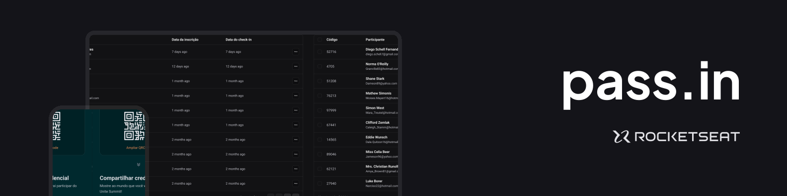
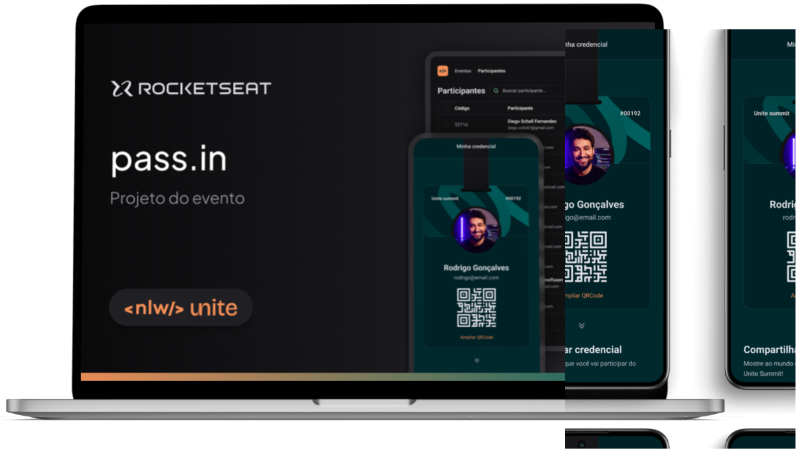

  

 

  
  <a aria-label="Completed" href="https://rocketseat.com.br/">
    </img>
</a>

## :speech_balloon: Sobre

Este projeto foi desenvolvido durante o evento NLW Unite da [Rocketseat](https://www.rocketseat.com.br).
 

O  pass.in é uma aplicação de **gestão de participantes em eventos presenciais**. 
A ferramenta permite que o organizador cadastre um evento e abra uma página pública de inscrição.
Os participantes inscritos podem emitir uma credencial para check-in no dia do evento.
O sistema fará um scan da credencial do participante para permitir a entrada no evento.

 

Os principais conceitos exercitados durante o desenvolvimento foram:

### Back-end

- Construção de API REST com Fastify
- Documentação com o Swagger
- Testes utilizando a lib Zod

### Front-end

- Imutabilidade
- Estados
- Propriedades
- Componentização
- LocalStorage
- URL State

### Mobile
- Desenvolvimento utilizando o Expo
- Utilização do NativeWind
- Persistências de dados com Zustand e AsyncStorage 
- Animações com React Reanimated e Moti

## :camera: Preview

  

## :rocket: Tecnologias Utilizadas

  
  
  
    
    
    
    
    
 

 

  Feito com 💚

